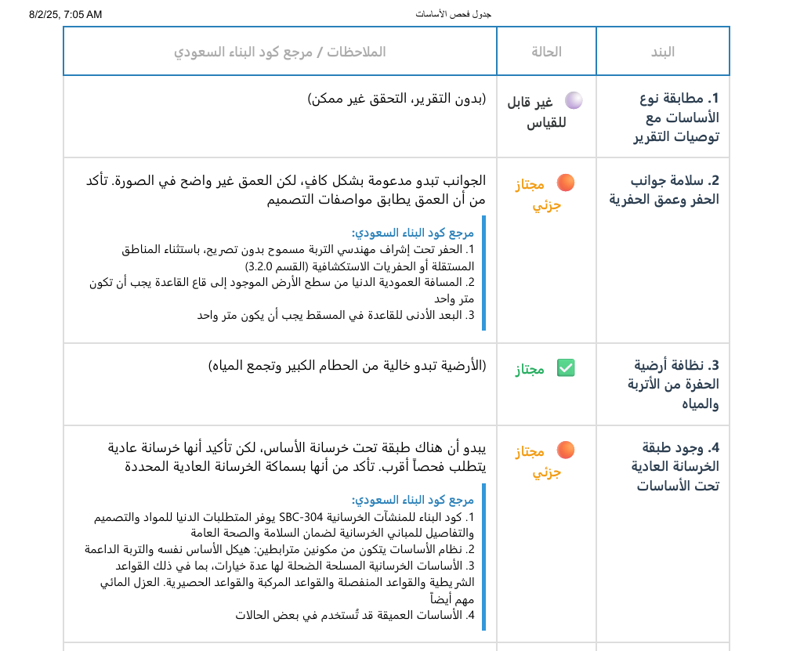
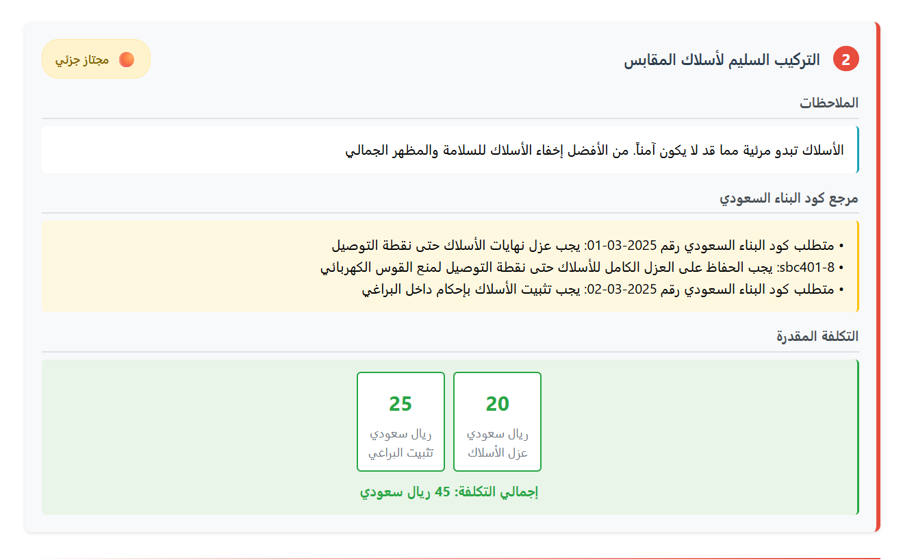
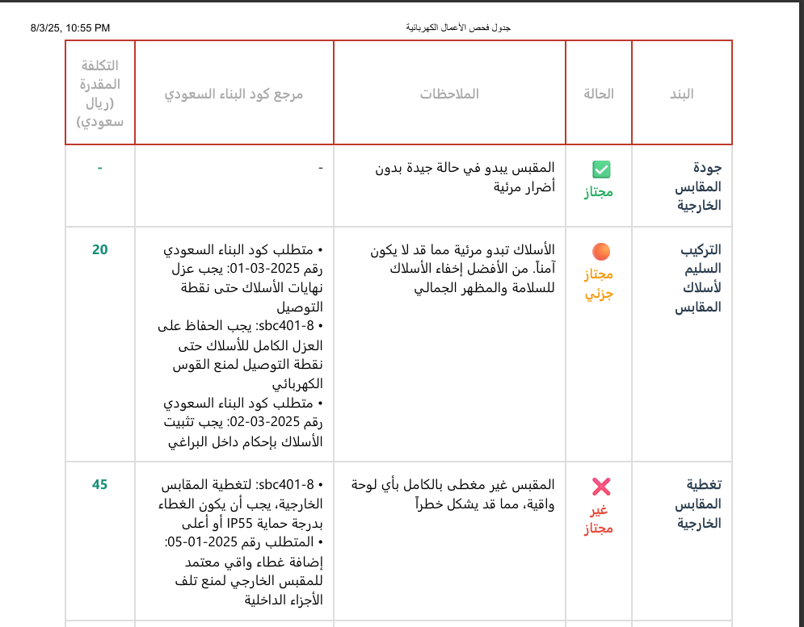

# Llama2 Saudi Bot


**Llama2 Saudi Bot** is a professional, AI-powered assistant designed to deliver intelligent, context-aware responses using state-of-the-art language models and vector search. Built on the **Mistral-7B-Instruct** model, it provides high-quality natural language understanding and generation for technical, legal, and multilingual use cases. The web interface is built using **Flask** (Python) with custom **HTML**, **CSS**, and **JavaScript** for a modern, responsive user experience.

---


---

## Table of Contents

- [Introduction](#introduction)
- [Features](#features)
- [Demo](#demo)
- [Prerequisites](#prerequisites)
- [Installation](#installation)
- [Getting Started](#getting-started)
- [Usage](#usage)
- [Results and Documentation](#results-and-documentation)
- [Screenshots](#screenshots)
- [Contributing](#contributing)
- [License](#license)
- [Contact](#contact)

---

## Introduction

**Llama2 Saudi Bot** is built to handle complex queries and provide accurate, context-aware answers. It leverages the **Mistral-7B-Instruct-v0.1.Q4_K_M.gguf** model for advanced language processing and integrates with FAISS for efficient vector-based search.

**Key Use Cases:**
- Answering domain-specific queries (technical, legal, medical, etc.)
- Summarizing and retrieving information from large datasets
- Supporting multilingual and localized interactions

---

## Features

- **Advanced Language Model:** Powered by the Mistral-7B-Instruct model
- **Vector Search:** Efficient document retrieval using FAISS
- **Multilingual Support:** Translations for multiple languages
- **Customizable:** Adaptable to various domains and use cases
- **Web Interface:** Built with Flask (Python), HTML, CSS, and JavaScript for a modern, user-friendly experience

---


## Demo

Below are some screenshots showcasing the Flask-based web interface and functionality:

<p align="center">
    
</p>
<p align="center">
    
</p>
<p align="center">
    
</p>

---

## Prerequisites

Before you begin, ensure you have:

- Python 3.6 or higher
- Required Python packages (see `requirements.txt`):
    - `langchain`, `sentence-transformers`, `faiss`, `PyPDF2`, `ctransformers`, `deep-translator`

---

## Installation

1. **Clone the repository:**
    ```bash
    git clone https://github.com/ahmad1adel/newSaudiCode.git
    cd llama2-saudi-bot
    ```

2. **Create a Python virtual environment (recommended):**
    ```bash
    python -m venv venv
    # On Windows:
    venv\Scripts\activate
    # On macOS/Linux:
    source venv/bin/activate
    ```

3. **Install dependencies:**
    ```bash
    pip install -r requirements.txt
    ```

4. **Download the model:**
    Download **Mistral-7B-Instruct-v0.1.Q4_K_M.gguf** from [Hugging Face](https://huggingface.co/mistralai/mistral-7b-instruct-v0.1).

5. **Configure the project:**
    Update the `DB_FAISS_PATH` variable in `model.py` and adjust other settings as needed.

---

## Getting Started

1. Ensure your environment is set up and all dependencies are installed.
2. Start the bot:
    ```bash
    python app.py
    ```
3. Open your browser and go to `http://localhost:5000` to interact with the bot through the custom web interface.

---

## Usage

Llama2 Saudi Bot can be used for:

- Querying domain-specific knowledge
- Retrieving and summarizing documents
- Translating and localizing content

Simply input your query in the web interface, and the bot will provide a detailed, context-aware response based on the available data.

---

## Results and Documentation

### PDF Reports

The following PDF reports are available for reference:

- [Saudi Code](Results_pdf/Saudi%20Code.pdf)
- [الجديد تقرير فحص الأعمال الكهربائية](Results_pdf/الجديد%20تقرير%20فحص%20الأعمال%20الكهربائية%20.pdf)
- [جدول فحص الأساسات](Results_pdf/جدول%20فحص%20الأساسات%20.pdf)
- [جدول فحص الأساسات بدون الملاحظات](Results_pdf/جدول%20فحص%20الأساسات%20بدون%20الملاحظات.pdf)
- [جدول فحص الأعمال الكهربائية](Results_pdf/جدول%20فحص%20الأعمال%20الكهربائية.pdf)

---

## Contributing

Contributions are welcome! To contribute:

1. Fork the repository
2. Create a new branch for your feature or bug fix
3. Make your changes and ensure all tests pass
4. Submit a pull request with a detailed explanation of your changes

---

## License

This project is licensed under the MIT License. See the [LICENSE](LICENSE) file for details.

---

## Links

- [Mistral-7B-Instruct Model](https://huggingface.co/mistralai/mistral-7b-instruct-v0.1)
- [Flask Documentation](https://flask.palletsprojects.com/)
- [FAISS](https://github.com/facebookresearch/faiss)
- [Sentence Transformers](https://huggingface.co/sentence-transformers/all-MiniLM-L6-v2)

---

## Contact

For questions, suggestions, or collaboration, feel free to reach out via [LinkedIn](https://www.linkedin.com/in/ahmad1adel/) or open an issue on GitHub.

---

Happy coding with **Llama2 Saudi Bot**! 🚀